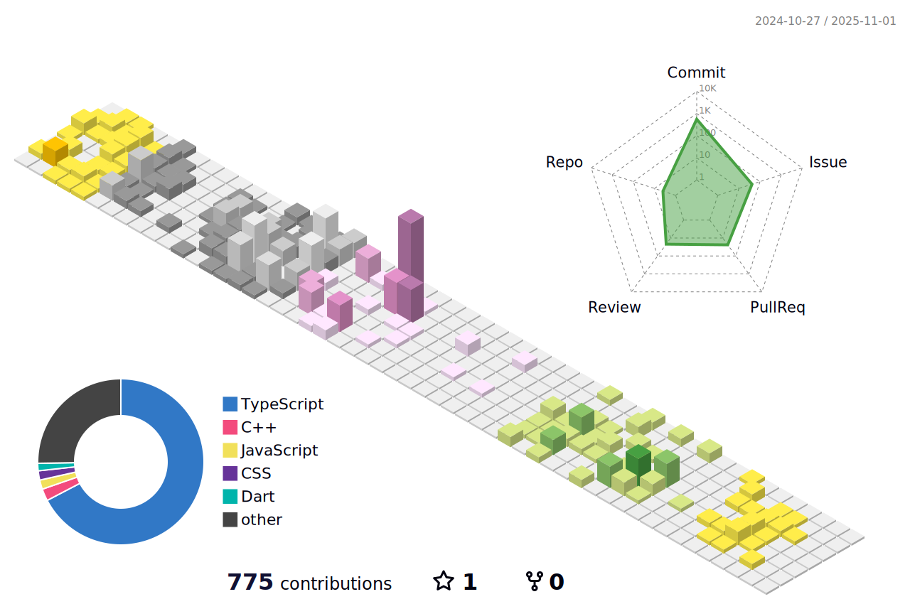

<div style="display: flex; justify-content: flex-start; margin-top: 4px;">
  
</div>


# Hey There! 👋

**I'm Odyssey** – I'm a university student and a frontend developer.  
I'm currently diving deeper into fullstack development and exploring new technologies every day.

I'm passionate about:
- ✨ Trendy frontend technologies
- 📰 Tech news & innovation
- 🚀 Startup building and entrepreneurship

I love building cool web & app experiences, sharing ideas, and always learning something new.

## 🛠️ Tech Stack
[](https://skillicons.dev)

<!--START_SECTION:waka-->


**I'm an Early 🐤** 

```text
🌞 Morning                57 commits          ░░░░░░░░░░░░░░░░░░░░░░░░░   01.92 % 
🌆 Daytime                1634 commits        ██████████████░░░░░░░░░░░   55.09 % 
🌃 Evening                663 commits         ██████░░░░░░░░░░░░░░░░░░░   22.35 % 
🌙 Night                  612 commits         █████░░░░░░░░░░░░░░░░░░░░   20.63 % 
```
📅 **I'm Most Productive on Thursday** 

```text
Monday                   550 commits         █████░░░░░░░░░░░░░░░░░░░░   18.54 % 
Tuesday                  390 commits         ███░░░░░░░░░░░░░░░░░░░░░░   13.15 % 
Wednesday                633 commits         █████░░░░░░░░░░░░░░░░░░░░   21.34 % 
Thursday                 635 commits         █████░░░░░░░░░░░░░░░░░░░░   21.41 % 
Friday                   516 commits         ████░░░░░░░░░░░░░░░░░░░░░   17.40 % 
Saturday                 106 commits         █░░░░░░░░░░░░░░░░░░░░░░░░   03.57 % 
Sunday                   136 commits         █░░░░░░░░░░░░░░░░░░░░░░░░   04.59 % 
```


📊 **This Week I Spent My Time On** 

```text
🕑︎ Time Zone: Asia/Seoul

💬 Programming Languages: 
TypeScript               3 hrs 33 mins       ██████████████████████░░░   87.14 % 
SQL                      10 mins             █░░░░░░░░░░░░░░░░░░░░░░░░   04.39 % 
Prisma                   10 mins             █░░░░░░░░░░░░░░░░░░░░░░░░   04.26 % 
C/C++                    4 mins              █░░░░░░░░░░░░░░░░░░░░░░░░   02.01 % 
C                        3 mins              ░░░░░░░░░░░░░░░░░░░░░░░░░   01.59 % 

🔥 Editors: 
Cursor                   3 hrs 43 mins       ███████████████████████░░   91.33 % 
DataGrip                 10 mins             █░░░░░░░░░░░░░░░░░░░░░░░░   04.36 % 
CLion                    8 mins              █░░░░░░░░░░░░░░░░░░░░░░░░   03.60 % 
VS Code                  1 min               ░░░░░░░░░░░░░░░░░░░░░░░░░   00.71 % 
```


 Last Updated on 31/03/2025 04:19:00 UTC
<!--END_SECTION:waka-->

<a href="https://github.com/anuraghazra/github-readme-stats">
    
</a> 

<a href="https://github.com/anuraghazra/github-readme-stats">
  
</a>





<!--내용 부분-->
<h3 align="center">🔥 My Main Skills! 🔥</h3>

<div align="center">
  &nbsp
   &nbsp
  &nbsp
</div>

<br>
<h3 align="center">🌐 My Programming Langs 🌐</h3>

<div align="center">
  &nbsp
   &nbsp
  &nbsp
</div>

<div align="center">
   &nbsp
   &nbsp
</div>

<br>
<h3 align="center">🖇️ Skills related to the Main Skills 🖇️</h3>
<div align="center">
 &nbsp
  &nbsp
  &nbsp
</div>
<div align="center">
  &nbsp
  &nbsp
  &nbsp
</div>
<div align="center">
  &nbsp
   &nbsp
   &nbsp
</div>
<br>

<h3 align="center">😅 I've learned and tried once, once... 😅</h3>
<div align="center">
  &nbsp
  &nbsp
  &nbsp
</div>
<div align="center">
  &nbsp
 &nbsp
</div>
<br>

<h3 align="center">🚀 Planning to Learn real sooooon 🚀</h3>
<div align="center">
  &nbsp
  &nbsp
  &nbsp
</div>
<div align="center">
  
 
</div>

<br>

<h3 align="center">🛠 Tools 🛠</h3>
<div align="center">
  &nbsp
  &nbsp
  &nbsp
</div>

<div align="center">
  <div align="center">
  &nbsp
  &nbsp
</div>

<div align="center">
  <div align="center">
    &nbsp
  &nbsp
  &nbsp
</div>

<div align="center">
  <div align="center">
    &nbsp
    &nbsp
     &nbsp
</div>
<br>

<h3 align="center">📫 Contact 📫</h3>
<div align="center">
  <a href="https://www.instagram.com/e.u__jin/">
    
  </a>
  <a href="odyssey409@naver.com">
    
  </a>
</div>
<br>
<br>


# Most recent Velog posts
<!-- BLOG-POST-LIST:START -->
- [로그아웃 기능 구현 &lpar;+ notFound 처리&rpar;](https://velog.io/@odyssey/%EB%A1%9C%EA%B7%B8%EC%95%84%EC%9B%83-%EA%B8%B0%EB%8A%A5-%EA%B5%AC%ED%98%84-notFound-%EC%B2%98%EB%A6%AC)
- [superRefine - Zod](https://velog.io/@odyssey/superRefine-Zod)
- [Cookie, Session 그리고 iron-session](https://velog.io/@odyssey/Cookie-Session-%EA%B7%B8%EB%A6%AC%EA%B3%A0-iron-session)
- [Password Hashing &lpar;bcrypt로&rpar;](https://velog.io/@odyssey/Password-Hashing-bcrypt%EB%A1%9C)
- [Relations](https://velog.io/@odyssey/Relations)
<!-- BLOG-POST-LIST:END -->


# THX For Reading My Profile! 🥹
<picture>
  <source media="(prefers-color-scheme: dark)" srcset="https://raw.githubusercontent.com/Odyssey409/Odyssey409/output/github-contribution-grid-snake-dark.svg">
  <source media="(prefers-color-scheme: light)" srcset="https://raw.githubusercontent.com/Odyssey409/Odyssey409/output/github-contribution-grid-snake.svg">
  
</picture>
