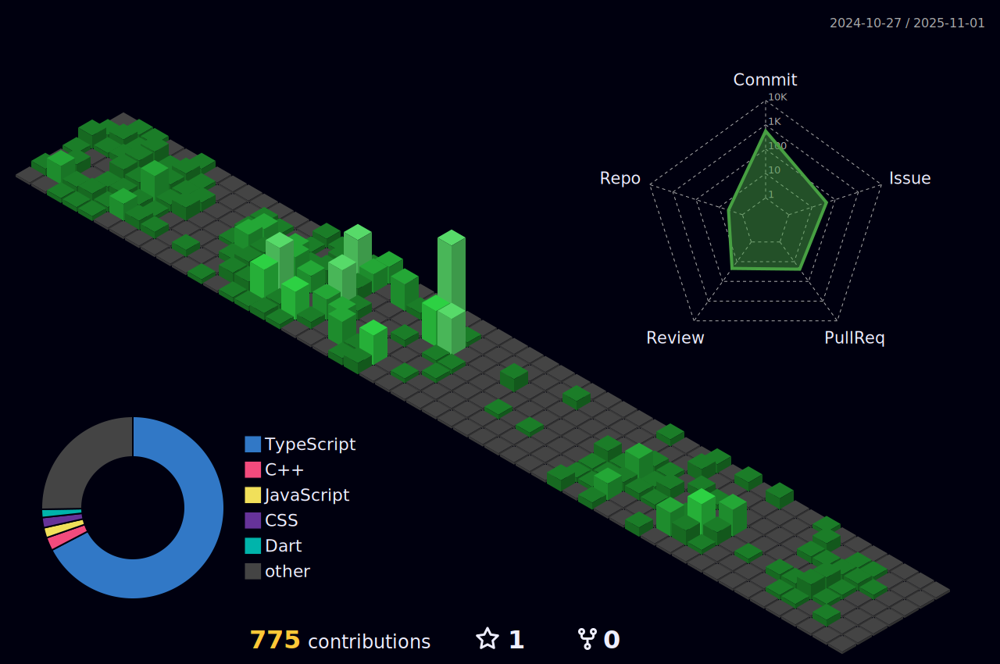

<div style="display: flex; justify-content: flex-start; margin-top: 4px;">
  
</div>


# Hey There!👋 안녕하세요😁

**I'm Odyssey** – I'm a university student and a frontend developer.  
I'm currently diving deeper into fullstack development and exploring new technologies every day.

I'm passionate about:
- ✨ Trendy frontend technologies
- 📰 Tech news & innovation
- 🚀 Startup building and entrepreneurship

I love building cool web & app experiences, sharing ideas, and always learning something new.

## 🛠️ Tech Stack
[](https://skillicons.dev)

## 📊 GitHub Stats
<!--
<a href="https://github.com/Odyssey409">
  
</a>
<a href="https://github.com/anuraghazra/github-readme-stats">
  
</a>

<br><br/>
-->


<!--START_SECTION:waka-->


**I'm an Early 🐤** 

```text
🌞 Morning                60 commits          ░░░░░░░░░░░░░░░░░░░░░░░░░   01.69 % 
🌆 Daytime                1874 commits        █████████████░░░░░░░░░░░░   52.91 % 
🌃 Evening                801 commits         ██████░░░░░░░░░░░░░░░░░░░   22.61 % 
🌙 Night                  807 commits         ██████░░░░░░░░░░░░░░░░░░░   22.78 % 
```
📅 **I'm Most Productive on Wednesday** 

```text
Monday                   702 commits         █████░░░░░░░░░░░░░░░░░░░░   19.82 % 
Tuesday                  494 commits         ███░░░░░░░░░░░░░░░░░░░░░░   13.95 % 
Wednesday                732 commits         █████░░░░░░░░░░░░░░░░░░░░   20.67 % 
Thursday                 723 commits         █████░░░░░░░░░░░░░░░░░░░░   20.41 % 
Friday                   626 commits         ████░░░░░░░░░░░░░░░░░░░░░   17.67 % 
Saturday                 115 commits         █░░░░░░░░░░░░░░░░░░░░░░░░   03.25 % 
Sunday                   150 commits         █░░░░░░░░░░░░░░░░░░░░░░░░   04.23 % 
```


📊 **This Week I Spent My Time On** 

```text
🕑︎ Time Zone: Asia/Seoul

💬 Programming Languages: 
YAML                     2 hrs 51 mins       █████████████████████████   98.09 % 
TypeScript               1 min               ░░░░░░░░░░░░░░░░░░░░░░░░░   00.94 % 
CSS                      1 min               ░░░░░░░░░░░░░░░░░░░░░░░░░   00.85 % 
JSON                     0 secs              ░░░░░░░░░░░░░░░░░░░░░░░░░   00.06 % 
JavaScript               0 secs              ░░░░░░░░░░░░░░░░░░░░░░░░░   00.04 % 

🔥 Editors: 
Cursor                   2 hrs 54 mins       █████████████████████████   100.00 % 
```


 Last Updated on 19/08/2025 15:12:29 UTC
<!--END_SECTION:waka-->

<!--
<a href="https://github.com/anuraghazra/github-readme-stats">
    
</a> 

<a href="https://github.com/anuraghazra/github-readme-stats">
  
</a>

-->


<br><br/>

#   


<!-- BLOG-POST-LIST:START -->
- [useActionState](https://velog.io/@odyssey/useActionState)
- [URL.createObjectURL&lpar;&rpar;로 파일 미리보기 구현](https://velog.io/@odyssey/URL.createObjectURL%EB%A1%9C-%ED%8C%8C%EC%9D%BC-%EB%AF%B8%EB%A6%AC%EB%B3%B4%EA%B8%B0-%EA%B5%AC%ED%98%84)
- [&lt;label&gt; 태그의 활용](https://velog.io/@odyssey/label-%ED%83%9C%EA%B7%B8%EC%9D%98-%ED%99%9C%EC%9A%A9)
- [IntersectionObserver로 무한 스크롤 구현하기](https://velog.io/@odyssey/IntersectionObserver%EB%A1%9C-%EB%AC%B4%ED%95%9C-%EC%8A%A4%ED%81%AC%EB%A1%A4-%EA%B5%AC%ED%98%84%ED%95%98%EA%B8%B0-1)
- [Faker로 쉽게 더미 데이터 생성하기](https://velog.io/@odyssey/Faker%EB%A1%9C-%EC%89%BD%EA%B2%8C-%EB%8D%94%EB%AF%B8-%EB%8D%B0%EC%9D%B4%ED%84%B0-%EC%83%9D%EC%84%B1%ED%95%98%EA%B8%B0)
<!-- BLOG-POST-LIST:END -->

---

## 🙏 Thanks for stopping by!

If you made it this far, thanks a ton for reading through my profile.  
I’m always learning, building, and sharing — so feel free to connect or drop a message!

> Stay curious, keep coding, and build something awesome. 🚀
<picture>
  <source media="(prefers-color-scheme: dark)" srcset="https://raw.githubusercontent.com/Odyssey409/Odyssey409/output/github-contribution-grid-snake-dark.svg">
  <source media="(prefers-color-scheme: light)" srcset="https://raw.githubusercontent.com/Odyssey409/Odyssey409/output/github-contribution-grid-snake.svg">
  
</picture>

---


